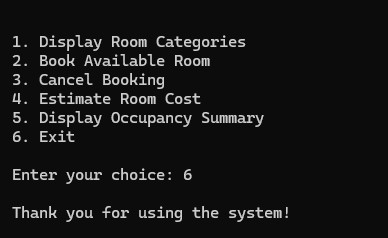

# Hotel Booking System (C++)

## About the Project
This is a console-based hotel room management application written entirely in C++. It was developed to demonstrate the practical application of core Programming Fundamentals. The system manages a 10-room hotel and handles essential front-desk operations entirely in-memory, without the use of databases or file storage.

## Features

* **Display Room Categories:** View all ten rooms, their categories (Standard, Deluxe, Suite), nightly rates, and current availability status.
  
  

* **Book Available Room:** Select a room and duration of stay. The system rigorously validates the input, updates the room status, and generates a detailed bill including a 16% GST.
  
  

* **Cancel Booking:** Frees up a previously booked room using pointer-based logic to update memory directly.
  
  

* **Estimate Room Cost:** Preview the cost of a stay (including taxes) for any room category without committing to a booking.
  
  

* **Occupancy Summary:** Instantly view the total number of booked versus available rooms.
  
  

* **Exit Program:** Cleanly terminate the console session.
  
  

## Core Concepts Applied
This project intentionally implements foundational C++ constructs to build a reliable, crash-resistant console application:
* **Arrays:** Parallel arrays manage room statuses, categories, and prices centrally.
* **User-Defined Functions:** The program logic is cleanly divided into seven distinct modular functions (e.g., `bookRoom()`, `displayRooms()`, `occupancySummary()`).
* **Loops:** Uses `for` loops to iterate through room arrays, and `while`/`do-while` loops for the persistent main menu and strict user input validation.
* **Conditional Logic:** `if-else` and `switch` statements route the program flow and validate booking conditions.
* **Pointers:** Memory addresses are securely passed and dereferenced (specifically between the `cancelBooking()` and `resetRoom()` functions) to alter room availability.

## Setup and Execution
1. Clone this repository to your local machine.
2. Compile the source code using any standard C++ compiler (e.g., GCC, Dev-C++ or Visual Studio).
3. Run the generated executable to interact with the system via the console menu.
